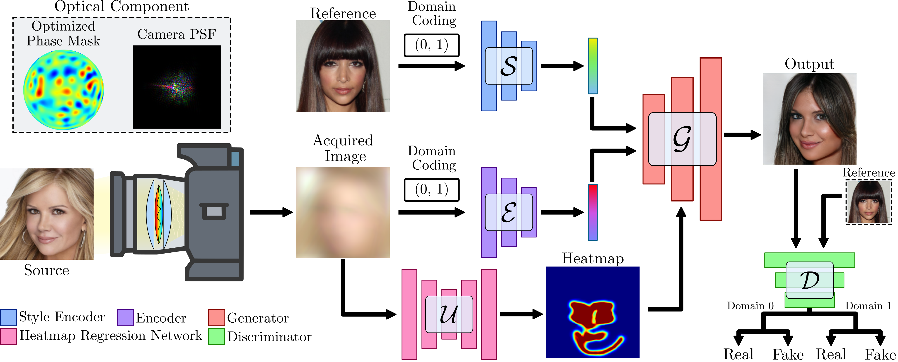

## Privacy-preserving Optics for Enhancing Protection in Face De-identification

<p align="left"></p>


> **Privacy-preserving Optics for Enhancing Protection in Face De-identification**<br>
> [Jhon Lopez](https://scholar.google.com/citations?user=d1QOBbYAAAAJ&hl=es), [Carlos Hinojosa](https://carloshinojosa.me/), [Henry Arguello](https://scholar.google.com/citations?user=R7gjbGIAAAAJ&hl=es)\*,
> [Bernard Ghanem](https://www.bernardghanem.com/)\*
> In CVPR 2024. (\* Indicates equal PI contribution)

> Paper: https://arxiv.org/pdf/2404.00777<br>
> Video: https://www.youtube.com/watch?v=iYzb-P6yCvc<br>

> **Abstract:** *The modern surge in camera usage alongside widespread computer vision technology applications poses significant privacy and security concerns.
> Current artificial intelligence (AI) technologies aid in recognizing relevant events and assisting in daily tasks in homes, offices, hospitals, etc. 
> The need to access or process personal information for these purposes raises privacy concerns. While software-level solutions like face de-identification 
> provide a good privacy/utility trade-off, they present vulnerabilities to sniffing attacks. In this paper, we propose a hardware-level face de-identification 
> method to solve this vulnerability. Specifically, our approach first learns an optical encoder along with a regression model to obtain a face heatmap while hiding 
> the face identity from the source image. We also propose an anonymization framework that generates a new face using the privacy-preserving image, face heatmap, 
> and a reference face image from a public dataset as input. We validate our approach with extensive simulations and hardware experiments.*

## Software installation
Clone this repository:

```bash
git clone https://github.com/JhEdLp/Privacy_Face2Face.git
cd Privacy_Face2Face/
```

Install the dependencies:
```bash
conda create -n privacy_env python=3.6.7
conda activate privacy_env
conda install pytorch==1.7.1 torchvision==0.8.2 torchaudio==0.7.2 cudatoolkit=11.0 -c pytorch
conda install x264=='1!152.20180717' ffmpeg=4.0.2 -c conda-forge
pip install opencv-python==4.1.2.30 ffmpeg-python==0.2.0 scikit-image==0.16.2
pip install pillow==7.0.0 scipy==1.2.1 tqdm==4.43.0 munch==2.5.0
pip install wandb # Optionally you can use wandb to record model training
```

## Datasets and pre-trained networks
We provide a script to download dataset used in our work and the corresponding pre-trained models. The datasets and network checkpoints will be downloaded and stored in the 
`data`, `checkpoints` and `pretrained_models` directories, respectively.

<b>CelebA-HQ.</b> To download the [CelebA-HQ](https://drive.google.com/drive/folders/0B4qLcYyJmiz0TXY1NG02bzZVRGs) dataset and the pre-trained network, run the following commands:
```bash
bash download.sh celeba-hq-dataset
bash download.sh checkpoints
bash download.sh pretrained-models
bash download.sh raf-models
```

To transform a custom image, first crop the image manually so that the proportion of face occupied in the whole is similar to that of CelebA-HQ. Then, run the following command for additional fine rotation and cropping. All custom images in the `inp_dir` directory will be aligned and stored in the `out_dir` directory.

```bash
python main.py --mode align \
               --inp_dir assets/representative/custom/female \
               --out_dir assets/representative/celeba_hq/src/female
```

## Evaluation metrics
To evaluate the model performance, we use [Fr&eacute;chet Inception Distance (FID)](https://arxiv.org/abs/1706.08500), Face Detection (FD), Bounding Box (BB), and Landmarks (LM)
distances using orinial and de-identified faces using [Dlib](http://dlib.net/) library and [MtCNN](https://ieeexplore.ieee.org/stamp/stamp.jsp?arnumber=7553523) model.

|      Model       |   FID    |  FD (MtCNN)  |  BB (MtCNN)  |  LM (MtCNN)  |  FD (Dlib)  |  BB (Dlib)  |  LM (Dlib)  |
|:----------------:|:--------:|:------------:|:------------:|:------------:|:-----------:|:-----------:|:-----------:|
|  Low Resolution  |  34.161  |    1.000     |    5.358     |    2.392     |    0.994    |    4.694    |    2.749    |
|   Privacy Lens   |  29.218  |    1.000     |    3.314     |    2.298     |    0.991    |    4.821    |    2.716    |


## Training networks
To train our model, run the following commands. Generated images and network checkpoints will be stored in the `expr/model_1` directory. 
Training takes about three days on a single Tesla V100 GPU.

```bash
# celeba-hq
python main.py --mode train --num_domains 2 --w_hpf 1 \
               --lambda_reg 1 --lambda_sty 1 --lambda_ds 1 --lambda_cyc 1 \
               --train_img_dir data/celeba_hq/train \
               --val_img_dir data/celeba_hq/val

```

## License
This work is distributed under the MIT License. See `LICENSE` for more information.

## Citation
If you find this work useful for your research, please cite our paper:

```
@article{lopez2024privacy,
  title={Privacy-preserving Optics for Enhancing Protection in Face De-identification},
  author={Lopez, Jhon and Hinojosa, Carlos and Arguello, Henry and Ghanem, Bernard},
  journal={arXiv preprint arXiv:2404.00777},
  year={2024}
}
```

## Acknowledgements
- Our code is based on the [StarGAN-v2](https://github.com/clovaai/stargan-v2) repository. We thank the authors for making their code publicly available.
- This work was supported by the King Abdullah University of Science and Technology (KAUST) Office of Sponsored Research through the Visual Computing Center (VCC) funding, the 
  SDAIA-KAUST Center of Excellence in Data Science and Artificial Intelligence (SDAIA-KAUST AI), and the Universidad Industrial de Santander (UIS), Colombia under the research projects VIE-3735 and VIE-3924.
