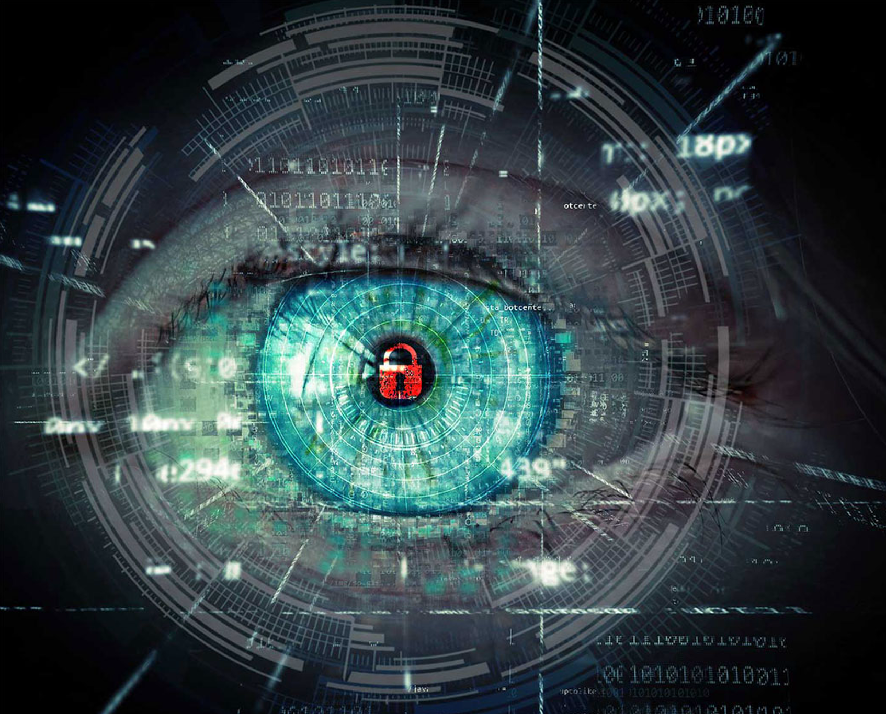

<!-- PROJECT LOGO -->
 

  

  <h3 align="center">Privacy-preserving Computer Vision</h3>

This repository contains a collection of projects aimed at enhancing privacy in computer vision applications. Each project is organized into its own folder for easy navigation.

## News and Updates :newspaper_roll:

**February 27, 2024**
- Our paper "Privacy-preserving Optics for Enhancing Protection in Face De-identification" has been accepted to CVPR 2024! The code is available [here](https://github.com/carlosh93/privacy-preserving-vision/tree/main/Face-DeId)

 

<!-- TABLE OF CONTENTS -->

  
Table of Contents

  <ol>
    <li>
      <a href="#about">About</a>
    </li>
    <li>
      <a href="#human-pose-estimation">Human Pose Estimation</a>
    </li>
    <li>
      <a href="#human-action-recognition">Human Action Recognition</a>
    </li>
    <li>
      <a href="#face-de-identification">Face De-identification</a>
    </li>
    <li>
      <a href="#image-captioning">Image Captioning</a>
    </li>
    <li>
      <a href="#">License</a>
    </li>
    <li>
      <a href="#">Contact</a>
    </li>
  </ol>

## About
In today's digital age, privacy is of paramount importance. With the increasing use of computer vision in various domains, ensuring the privacy of individuals' data has become crucial. This repository showcases our efforts and research in implementing privacy-preserving techniques in computer vision applications.

## Human Pose Estimation

## Human Action Recognition

## Face De-identification

> Paper: https://arxiv.org/pdf/2404.00777 
> Code: [Face-DeId](https://github.com/carlosh93/privacy-preserving-vision/tree/main/Face-DeId)

<b>Abstract:</b> The modern surge in camera usage alongside widespread computer vision technology applications poses significant privacy and security concerns. Current artificial intelligence (AI) technologies aid in recognizing relevant events and assisting in daily tasks in homes, offices, hospitals, etc. The need to access or process personal information for these purposes raises privacy concerns. While software-level solutions like face de-identification provide a good privacy/utility trade-off, they present vulnerabilities to sniffing attacks. In this paper, we propose a hardware-level face de-identification method to solve this vulnerability. Specifically, our approach first learns an optical encoder along with a regression model to obtain a face heatmap while hiding the face identity from the source image. We also propose an anonymization framework that generates a new face using the privacy-preserving image, face heatmap, and a reference face image from a public dataset as input. We validate our approach with extensive simulations and hardware experiments.

## Image Captioning

## License
Please see the License associated with each work in the corresponding folder.

## Contact
For any questions or inquiries, please contact me at carlos.hinojosa@kaust.edu.sa
